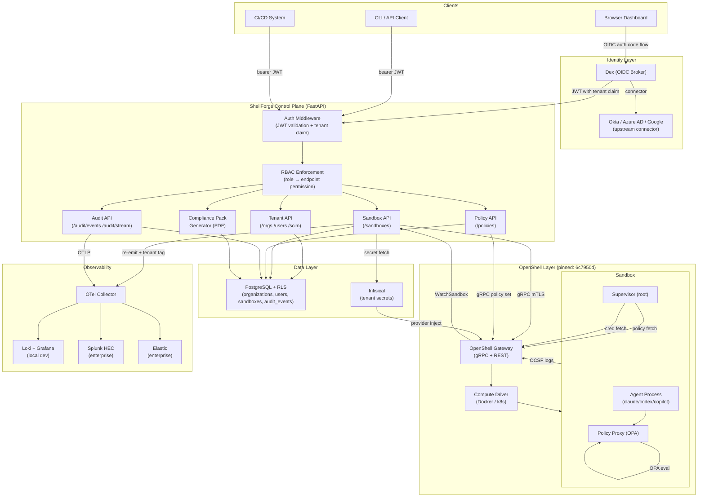

# ShellForge Architecture

## System Diagram

---

## Component Descriptions

### Identity Layer

**Dex** — OIDC broker. Presents a single stable OIDC endpoint to ShellForge. Upstream identity comes from pluggable connectors (static passwords for local dev; Okta/Azure AD/Google Workspace/LDAP/SAML for prod). The control plane is IdP-agnostic — it speaks only OIDC and reads the `tenant_id` claim injected by Dex.

### ShellForge Control Plane

**Auth Middleware** — validates every JWT on every request. Extracts `sub` (user ID), `email`, `role`, and `tenant_id` claims. Sets `SET LOCAL app.current_tenant_id` in Postgres for RLS enforcement. Never trusts `organization_id` from request body.

**RBAC Enforcement** — each FastAPI endpoint declares its required role via a dependency. Roles: `platform:admin`, `org:admin`, `org:developer`, `org:viewer`. Role stored in DB, not purely in JWT (JWT role is a hint; DB is authoritative).

**Tenant API** — CRUD for organizations, users, SCIM 2.0 provisioning endpoint. Organization provisioning also creates the tenant's namespaced Infisical path and the OpenShell provider for that tenant.

**Sandbox API** — wraps OpenShell gRPC. Creates sandboxes in the correct gateway for the requesting tenant, attaches tenant-namespaced providers, applies the selected policy template. All list/get operations filter by `shellforge.io/tenant` label.

**Policy API** — stores policy YAML versions in Postgres. Validates on write. Applies to running sandboxes via `UpdateConfig` gRPC. Tracks version history with diff capability.

**Audit API** — REST endpoint for querying audit events (filter by actor, action, resource, time range, tenant). SSE streaming endpoint for real-time dashboard feed. Hash chain integrity verification endpoint.

**Compliance Pack Generator** — queries audit events for a time range, maps each event to compliance control IDs (SOC2 CC6.1, CC7.2 / HIPAA §164.312 / PCI DSS Req 10.2), renders a PDF via Weasyprint.

### Data Layer

**PostgreSQL with RLS** — single database, multiple tenants. Every tenant-scoped table has `organization_id` column with a RLS policy referencing `current_setting('app.current_tenant_id')`. Belt-and-suspenders: SQLAlchemy queries also filter by `organization_id`.

**Infisical** — self-hosted secrets management. Tenant secrets stored at `secret/tenants/{org_id}/`. Provides the ShellForge `SecretProvider` interface. Swappable to HashiCorp Vault or AWS Secrets Manager via `SECRET_BACKEND` env var.

### OpenShell Layer

Pinned at commit `6c7950da900921a24aa65e79c7b522ba12fd7875`. ShellForge wraps OpenShell's gRPC API; never modifies OpenShell source.

**Gateway** — OpenShell's control-plane. ShellForge communicates with it via gRPC (mTLS or OIDC bearer). OpenShell stores its own state in SQLite (dev) or Postgres.

**Sandbox** — isolated agent runtime. Supervisor fetches policy + credentials from gateway. Policy Proxy (OPA/regorus) enforces network rules. Agent process runs as `sandbox:sandbox` user.

**Tenant isolation above OpenShell** — ObjectMeta has no tenant field, so ShellForge labels every resource (`shellforge.io/tenant: <org_id>`) and always includes that label in list operations.

### Observability

**OTel Collector** — receives OTLP from ShellForge control plane. Also ingests re-emitted OCSF events from OpenShell sandbox logs (tagged with `tenant_id`). Fan-out to multiple SIEM targets via exporter config — zero code changes to add a new SIEM.

**OCSF + Hash Chain** — all ShellForge audit events use OCSF v1.7.0 schema. Each event includes `prev_hash` (SHA-256 of prior event) and `event_hash` (SHA-256 of this event's canonical JSON). Tamper detection: recompute any event's hash; if it doesn't match, the chain is broken.

---

## Tenant Isolation Enforcement Points

| Layer | Mechanism |
|---|---|
| API | JWT `tenant_id` claim, extracted and validated per request |
| Database | Postgres RLS + `SET LOCAL app.current_tenant_id` |
| ORM | SQLAlchemy `.filter(organization_id == ctx.tenant_id)` |
| OpenShell | Label selector `shellforge.io/tenant=<org_id>` on all list calls |
| Secrets | Infisical path namespaced by `tenant_id` |
| Audit | Every event tagged with `tenant_id`, streamed per-tenant |

---

## Swappability Matrix

| Component | Local Dev | Enterprise Prod | Swap Mechanism |
|---|---|---|---|
| IdP | Dex + static passwords | Dex → Okta/Azure AD connector | Dex YAML connector config |
| Secrets | Infisical docker-compose | Infisical Helm / Vault / AWS SM | `SECRET_BACKEND` env var + `SecretProvider` interface |
| DB | Postgres (docker-compose) | Postgres (external) | `DATABASE_URL` env var |
| SIEM | Loki → Grafana | Splunk HEC / Elastic | OTel Collector exporter config |
| Compute | Docker (OpenShell driver) | k8s (OpenShell driver) | OpenShell `COMPUTE_DRIVER` env var |
| PDF renderer | Weasyprint | Weasyprint (or Puppeteer) | `PDF_BACKEND` env var |
